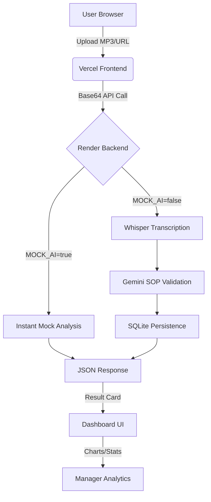

# 🎬 Video Demo Plan: Call Analytics AI

This guide helps you record a professional 2-5 minute demo of your project.

---

## 📊 1. System Flowchart (The "How it Works")

---

## 📝 2. Narration Scratchpad (Script)

### **Minute 0:00 - 0:30: Introduction**
*   "Hello everyone! Today I'm presenting **Call Analytics AI**, a powerful platform designed to automate quality assurance for call centers."
*   "We support **Tamil (Tanglish)**, **Hindi (Hinglish)**, and **English**, making it perfect for diverse regional markets."

### **Minute 0:30 - 1:30: The Live Upload**
*   (Action: Select an audio file or paste a URL in the UI).
*   "Let's jump into the core feature: **Real-time Call Analysis**."
*   "I'll select a mixed-language recording. As I click upload, the system converts the file to Base64 and shoots it to our **Render-hosted Backend API**."
*   "Notice the progress steps: We move from Base64 conversion to Transcription and finally to **Gemini AI Analysis**."

### **Minute 1:30 - 3:00: Inspecting Results**
*   "The results are instant! As you can see, we have a **SOP Compliance Score** of 92%."
*   "The AI has automatically checked for: **Greeting**, **ID Verification**, and **Problem Solving**."
*   "Below, we see a **Concise Summary** and the full **Transcript**, along with auto-detected **Keywords** like 'EMI' and 'Payment'."

### **Minute 3:00 - 4:15: Management Analytics**
*   "For managers, we provide the **Analytics Dashboard** (Scroll down to Charts)."
*   "Here we track trends across all calls, identifying common rejection reasons and customer sentiment."
*   "This turns raw audio into actionable data for training and compliance."

### **Minute 4:15 - 5:00: Conclusion**
*   "Our system is deployed using a robust **Vercel + Render** architecture, ensuring it's scalable and always online."
*   "Thank you for watching the demo of Call Analytics AI!"

---

## 📑 3. Key Features to Show
- [ ] **Multi-language Support:** Highlight the Tamil/Hindi/English dropdown.
- [ ] **Instant Processing:** Show how fast the Mock Mode is.
- [ ] **SOP Validation:** Show the ✓ Pass / ✗ Fail indicators.
- [ ] **Analytics Dashboard:** Show the charts and global stats.
- [ ] **Semantic Search:** Show how to search for transcripts.

---

## 💡 Pro Tips for Recording:
1.  **Use Mock Mode:** Ensure `MOCK_AI=true` is set on Render so your demo is fast and never crashes.
2.  **Zoom In:** Zoom your browser to 125% so the text is clear on video.
3.  **No Background Noise:** Use a quiet room for your narration.
